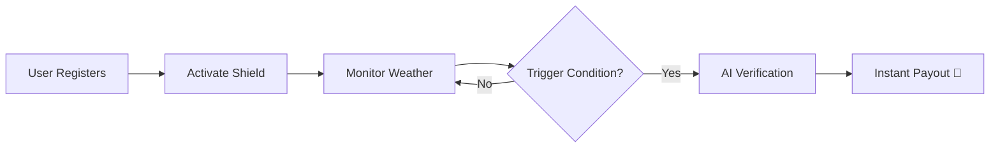

# 🛡️ KavachForWork

### *Climate-Adaptive Insurance for India’s Gig Workforce*


---

## 🚀 Overview

KavachForWork is an **AI-powered parametric micro-insurance platform** that provides **instant financial protection** to gig workers affected by extreme climate conditions.

> 💡 *We’re not insuring orders—we’re insuring India’s digital backbone.*

---

## 🚨 Problem

* 🌡️ Climate disruptions cause **25%+ income loss**
* 💼 Gig workers earn **per task (no work = no pay)**
* 📄 Traditional insurance is **slow, manual, and irrelevant**

👉 Workers must choose between:

* ⚠️ Health risk
* 💸 Financial loss

---

## 💡 Solution

Kavach uses:

* 🌍 Real-time weather data
* 🧠 AI-based verification
* ⚡ Instant UPI payouts

✔ No paperwork
✔ No delays
✔ Fully automated

---

## ⚙️ How It Works



---

## 🚀 Key Features

✨ Swipe-based shield activation
🌡️ Climate-triggered automatic payouts
⚡ Instant UPI settlement
🧠 AI-powered fraud detection
📱 Sensor-based verification
🌍 Real-time weather tracking
📊 Weather Oracle dashboard
💰 Wallet & bonus system
🔄 Automated premium deduction
🤖 AI assistant (24/7 support)

---

## 🧠 AI Fraud Detection

We use **multi-signal verification** to prevent fraud:

```
API Temp → 47°C
Battery Temp → 25°C
```

👉 Result:

```
❌ FRAUD DETECTED (Indoor Environment)
```

### Signals Used:

* Battery temperature
* Screen brightness
* GPS consistency
* Altitude variation
* Device behavior

---

## 📱 Real Use Case

### 🌡️ Heatwave Event

```
Temp → 45°C+
Duration → 3 days
```

### ⚡ System Action

* AI verifies exposure
* Claim approved

### 💸 Payout

```
+ ₹200 credited instantly
```

---

## 🔐 Adversarial Defense

### 🚨 Problem: GPS Spoofing

GPS alone is not reliable.

### 🛡️ Solution: Multi-Layer Trust System

* Sensor fusion verification
* Behavioral anomaly detection
* Weather cross-validation
* AI fraud detection

✔ Ensures only genuine users get paid

---

## 📈 Business Potential

Kavach introduces **AI-powered micro-insurance at scale**:

✔ Low-cost model
✔ Instant payouts
✔ Fraud-resistant
✔ Highly scalable

### 🎯 Target Users:

* Gig workers
* Delivery platforms
* Farmers
* Construction workers

---

## 🏗️ Tech Stack

### 💻 Frontend

* React.js + Vite
* Capacitor (Android wrapper)

### ⚙️ Backend

* Node.js + Express
* Socket.io

### 🧠 AI Service

* FastAPI (Python)
* Scikit-Learn (Random Forest)

### 🌍 APIs

* OpenWeather
* Open-Meteo
* OpenAQ

### 🗄️ Database

* MongoDB Atlas

### 🔄 Automation

* Node-Cron

### 💳 Payments

* Razorpay / UPI

---

## 🔮 Future Improvements

🚀 Satellite-based heat verification
🔗 Blockchain claim transparency
📡 IoT wearable integration
📊 AI-based city risk prediction
🏛️ Government disaster integration

---

## 🤝 Contributing

Contributions are welcome!
Feel free to fork, raise issues, or submit PRs.

---

## ⭐ Support

If you like this project, give it a ⭐ on GitHub!

---

## Pitch Deck

> https://drive.google.com/file/d/1kweQpUtAiEJhseuLCoZ2pvIsDnASY0cc/view

---


## 🏁 Final Thought

> **Kavach transforms climate risk into real-time financial security.**

---
